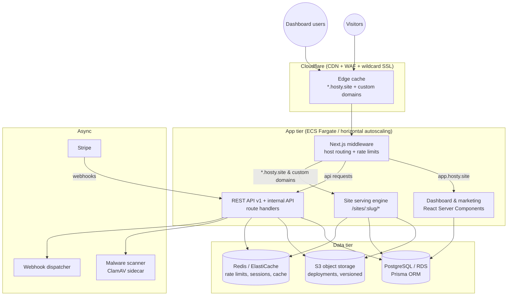

# Architecture

## High-level diagram

## Request flows

### 1. Upload → publish

1. Dashboard (or API/CLI/extension) sends a `multipart/form-data` POST to
   `/api/upload` (≤100 MB inline) or requests **presigned multipart S3 URLs**
   via `/api/upload/presign` for multi-GB files.
2. The server validates plan quotas (project count, per-file size, storage),
   sniffs and allow-lists MIME types, and runs the malware-scan hook.
3. ZIPs are extracted server-side with zip-slip protection; each extracted
   file is streamed to S3 under an immutable **deployment prefix**:
   `sites/{projectId}/{deploymentId}/{path}`.
4. A `Deployment` row plus one `ProjectFile` row per file is written in a
   single transaction; the project's `activeDeploymentId` pointer is flipped
   last. Publishing is therefore **atomic** — visitors never see a half
   deployed site, and rollback is a pointer swap.
5. The public URL `https://{slug}.hosty.site` is live immediately; the edge
   cache is purged by deployment ID so stale assets can never be served.

### 2. Serving a hosted site

1. Cloudflare terminates TLS for `*.hosty.site` (wildcard cert) and custom
   domains (SSL-for-SaaS), then forwards to the app with the original `Host`.
2. `middleware.ts` inspects the host. Anything that is not the app domain is
   rewritten to `/sites/{slug}/{path}`; custom domains are resolved to slugs
   through a Redis-cached lookup.
3. The serving route handler resolves slug → active deployment → file row,
   applies the password gate / email gate if enabled (signed HMAC cookies),
   streams the object from S3 with the stored content type, and injects the
   analytics beacon + feedback widget into HTML responses.
4. Cache headers: HTML `no-cache` (always revalidated so re-deploys are
   instant), hashed assets `public, max-age=31536000, immutable`, everything
   else `public, max-age=300, stale-while-revalidate`.

### 3. Analytics

The injected beacon posts to `/_hosty/event` on the same origin (no CORS, no
third-party cookies). Events are written to the `AnalyticsEvent` table with a
salted daily visitor hash (IP+UA → SHA-256, rotated every 24 h — no PII is
stored). Dashboards aggregate with SQL `GROUP BY`. At >10M events/month, swap
the sink for ClickHouse behind the same `recordEvent()` interface; the
dashboard queries live in one module (`src/lib/analytics.ts`) to make that
migration a single-file change.

## Scalability considerations

- **Stateless app tier.** All state lives in Postgres/Redis/S3, so the Next.js
  service scales horizontally behind a load balancer; session auth uses JWT
  cookies (no sticky sessions).
- **Read path is cache-first.** Site lookups (`host → project → deployment`)
  are cached in Redis for 30 s; file bytes are cached at the Cloudflare edge,
  so Postgres sees ~0 QPS from repeat visitors.
- **Uploads never block the event loop.** File bodies are streamed to S3;
  ZIP extraction is bounded (entry count, per-entry size and total size caps)
  to prevent zip bombs.
- **Hot partitioning.** `AnalyticsEvent` is indexed on `(projectId, createdAt)`
  and is append-only; a nightly job rolls events older than 90 days into
  daily aggregate rows.
- **99.99% availability** comes from: multi-AZ RDS, ECS services across ≥2 AZs,
  Cloudflare serving cached content during origin incidents ("always online"
  for static assets), and S3's own durability (11 nines).

## Trade-offs made deliberately

- **PHP is not executed.** Executing user PHP is an arbitrary-code-execution
  service, which is a different security product. `.php` uploads are accepted
  and served as static downloads, matching Tiiny Host's static-first model.
  (The storage layout leaves room for a sandboxed runtime later.)
- **Postgres for analytics first.** Simpler operationally; the interface is
  designed for a ClickHouse swap when volume demands it.
- **JWT sessions over DB sessions** for horizontal scale; revocation is
  handled by short (24 h) token lifetime plus a Redis denylist on password
  change / 2FA events.
