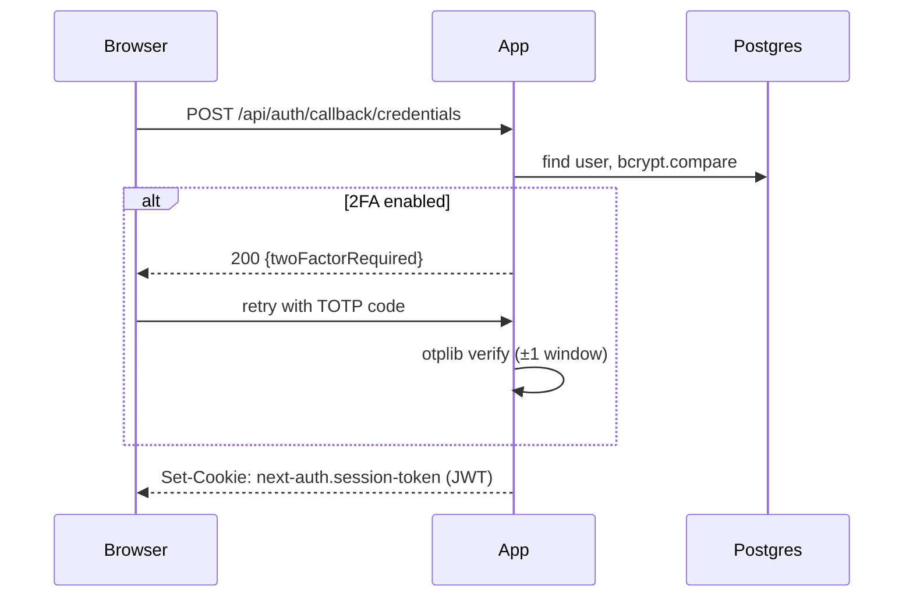

# Authentication flow

## Dashboard sessions (NextAuth)

- **Providers:** email+password (bcrypt, cost 12), Google OAuth, GitHub OAuth.
- **Strategy:** JWT session cookies (`httpOnly`, `secure`, `sameSite=lax`),
  24 h lifetime with sliding refresh. Stateless → horizontal scaling without
  sticky sessions.
- **Registration:** `POST /api/auth/register` (zod-validated, rate-limited
  5/min/IP). Passwords require ≥8 chars.
- **Password reset:** single-use token (SHA-256 stored, 1 h TTL) emailed via
  SMTP. Token is invalidated on use and on password change.



## Two-factor authentication

TOTP (RFC 6238) via `otplib`. Setup: server generates secret → QR code →
user confirms one code → secret is encrypted at rest and `twoFactorEnabled`
flips on. Login with credentials then requires a valid code (checked inside
the NextAuth `authorize` callback). Ten single-use recovery codes are issued
(hashed).

## API keys (public API)

- Format: `hty_` + 32 random bytes (base62). Shown once.
- Stored as SHA-256 hash; lookup by hash prefix index.
- Scopes `read`/`write`; per-key rate limit (default 120 req/min).
- `lastUsedAt` tracked for hygiene; revocation is immediate (no cache).

## Site-visitor gates (hosted sites)

Password/email gates never use platform sessions. Unlocking sets a signed
cookie scoped to the *site's* origin:

```
hosty_unlock_{projectId} = HMAC_SHA256(SIGNING_SECRET, projectId + passwordVersion)
```

`passwordVersion` increments when the owner changes the password, instantly
invalidating existing unlock cookies.

## Authorization model

- Personal projects: owner-only.
- Team projects: role check via `TeamMember.role`
  (`OWNER > ADMIN > EDITOR > VIEWER`); helper `assertProjectAccess(userId,
  projectId, minRole)` is the single enforcement point used by every route.
- Public API keys inherit the key owner's permissions, never more.
