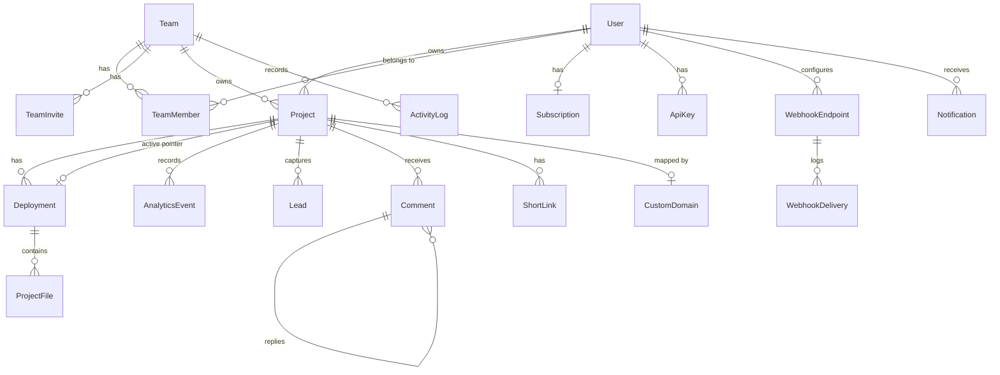

# Database schema

PostgreSQL via Prisma. Full source of truth: [`prisma/schema.prisma`](../prisma/schema.prisma).

## Entity-relationship overview

## Key modeling decisions

### Deployments are immutable, projects point at one

`Project.activeDeploymentId` is the only mutable piece of the publish path.
Every upload/edit creates a **new** `Deployment` with its own S3 prefix and
`ProjectFile` rows. Benefits:

- Atomic publish (pointer swap in one `UPDATE`)
- Version history and rollback for free (`Deployment` list = history)
- Safe concurrent uploads (last writer wins on the pointer, never on files)
- Old deployments are garbage-collected by a retention job per plan limits

### File metadata in Postgres, bytes in S3

`ProjectFile(path, size, contentType, storageKey, hash)` lets the serving
path answer "does `/about/index.html` exist, and what is its type?" with one
indexed lookup (`@@unique([deploymentId, path])`) without touching S3 for
404s, directory-index resolution, or SPA fallback decisions.

### Analytics events are append-only and pseudonymous

`visitorId = sha256(dailySalt + ip + userAgent)` — a stable ID for 24 h that
cannot be reversed to an IP. Sessions are 30-minute windows computed at query
time. Indexes: `(projectId, createdAt)` and `(projectId, visitorId)`.

### Quotas are derived, not stored

`User.storageUsed` is an incrementally-maintained counter (updated in the
same transaction as deployment writes) with a nightly reconciliation job
against `SUM(ProjectFile.size)` — fast reads, self-healing accuracy.

### Billing

`Subscription` mirrors Stripe state (`stripeCustomerId`, `stripePriceId`,
`status`, `currentPeriodEnd`). The app never trusts client-side plan claims;
`getUserPlan()` resolves plan → quota object from the subscription row, and
Stripe webhooks are the only writer.

## Migrations

- Local: `npx prisma migrate dev`
- Production: `npx prisma migrate deploy` (runs in CI before rollout; all
  migrations must be backwards-compatible with the previous app version —
  expand/contract pattern).
